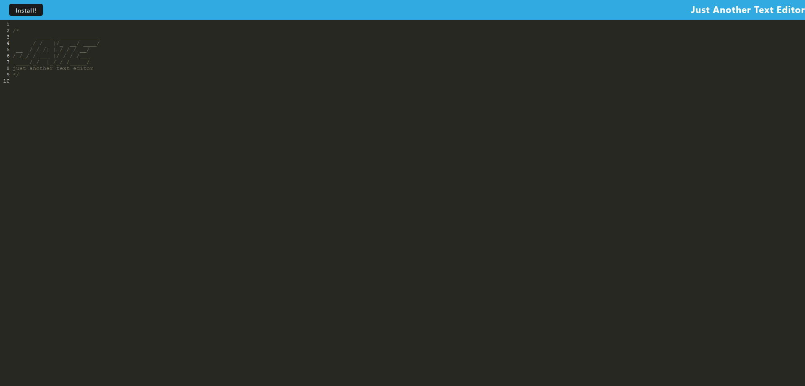

# text-editor

## Description

This is a text editor that runs in the browser. It features a number of data persistence techniques that serve as redundancy in case one of the options is not supported by the browser. The application also functions offline.

A video walkthrough has been recorded to demonstrate its functions. 

> Github Repository Link: [https://github.com/nevan-dsouza/text-editor](https://github.com/nevan-dsouza/text-editor)
>
> Deployed Site Link: [https://cryptic-brook-56262.herokuapp.com/](https://cryptic-brook-56262.herokuapp.com/)

## Table of Contents

1. [Installation](#installation)
2. [Usage](#usage)
3. [Example](#example)
4. [License](#license)
5. [Questions](#questions)

## Installation

Type "npm install" in the console to install the dependancies this application requires.

## Usage

In order to run this program, open up your terminal, navigate to the main folder, then enter the command: "npm run start:dev". After that, head to your localhost:3000 to check out the application. 

# Screenshot

Here is a screenshot of the app

## License

This project is under the "Unlicense" license.

## Questions

My GitHub Page: [nevan-dsouza](https://github.com/nevan-dsouza)
